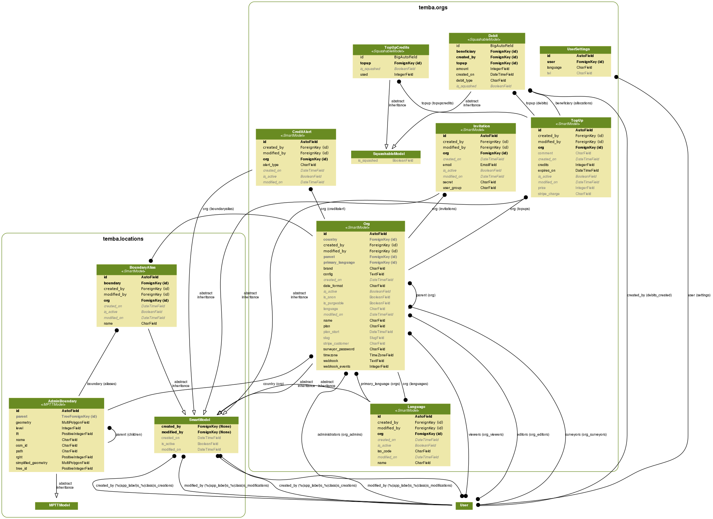

# Implementado
* Ao criar um novo usuário, um usuário com o mesmo username é criado a nível de
banco de dados. A senha desse usuário é a mesma usada no database default do
settings.py.
> Caso o username seja um email, nós fazemos algumas conversões por questões de 
  compatibilidade com o sistema de autenticação do postgres.
  Ex: foo@bar.com => foo__at__bar__dot__com
* Injetamos um custom manager(BlackMage) em cada model. Atualmente ele não faz
nada de especial, está sendo usado apenas como prova conceitual.
* Uma vez logado, injetamos nas configurações do Django, uma nova configuração
de acesso ao banco de dados e modificamos o alias da conexão de banco de dados
que os models usam para acessar o banco de dados. Isso fará com que o usuário
se conecte ao banco com sua conta, e não com a conta default. Uma vez logado
ele só conseguirá acessar os registros que casarem com a row restriction que nós
criamos(nesse momento essa row restriction só verifica se ele é o proprietário).

## Melhorias
* Atualmente todos os usuários são criados com a mesma senha do usuário que
acessa o database default. Poderíamos usar a senha criptografada do usuário
ao criá-lo.
* Todo usuário com perfil de administrador, deve ser criado no banco como
superuser(**no momento essa é a solução mais rápida, mas talvez não seja
a melhor**), porque dessa forma as row restrictions não serão aplicadas.

# Desafios
## Como fazer com que cada usuário veja apenas os dados do seu estado?
### Proposta 1

Cada organização(**temba.org.Org**) pode ser vinculada a um país(**temba.locations.BoundaryAlias**),
_que atualmente é opcional_.

Ao cadastrar um novo usuário para uma Org, temos que vinculá-lo a um estado do país da Org.
Precisamos armazenar o id do BoundaryAlias e a sigla do estado para que o postgres possa aplicar
a row restriction.

> Devemos deixar essa regra o mais simples possível, porque ela será traduzida em uma row restriction,
  e excesso de complexidade acarretará em perda de desempenho. 
